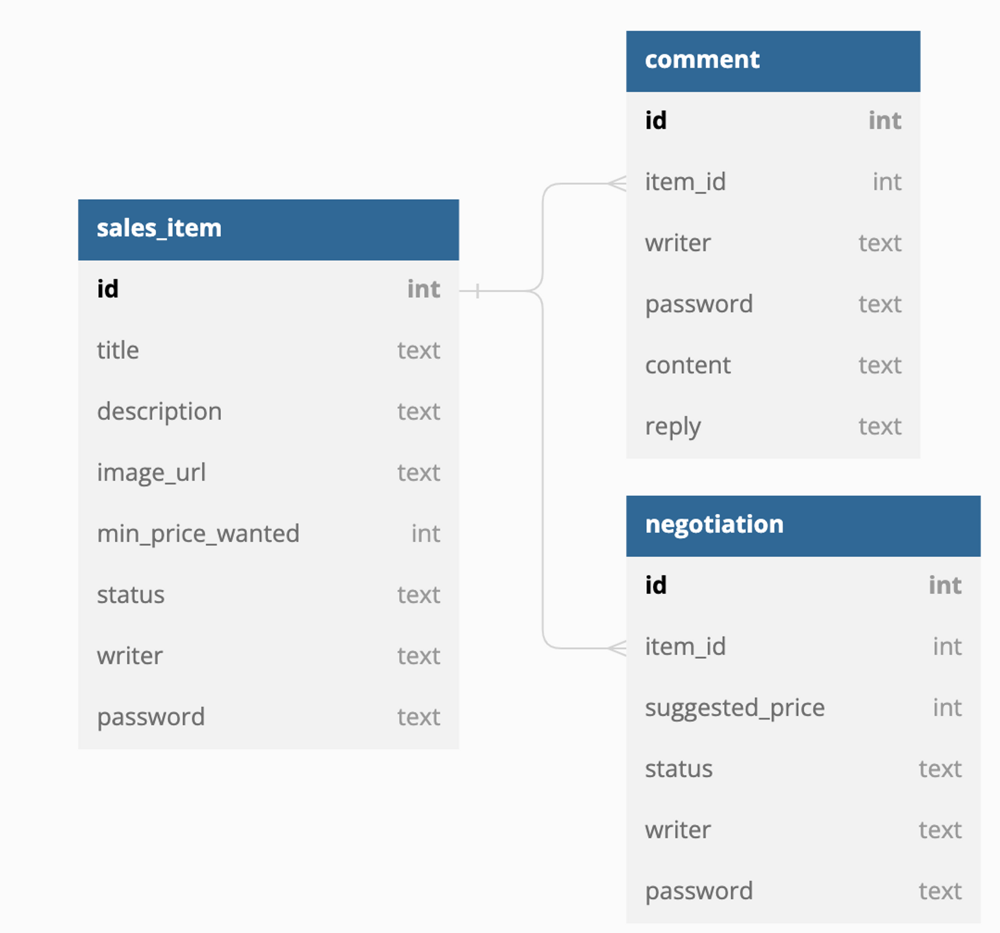

# ♻️멋사마켓♻️
> 🥕당근마켓, 중고나라 등을 착안하여 중고 제품 거래 플랫폼을 만들어보는 미니 프로젝트입니다.

_사용자가 중고 물품을 자유롭게 올리고, 댓글을 통해 소통하며, 최종적으로 구매 제안에 대하여 수락할 수 있는 형태의 
중고 거래 플랫폼을 만드는 프로젝트입니다._

*****

## 📅 개발 기간
- 2023.06.29 ~ 2023.07.04

*****

## 📌 멋사마켓 ERD



*****

## ⚙️ 개발 환경
### `JDK : 17.0.7`
### `IDE : IntelliJ IDEA`
### `Framework : Spring 6.0.10 (SpringBoot 3.1.1)`
### `DB : SQLite`
### `Dependency`
> Spring Web
> 
> Spring Boot DevTools
> 
> Spring Data JPA
> 
> Lombok
> 
> Validation

*****

## 📃 주요 기능

- ### 📌 중고 물품 등록

  <details>
  <summary>End Point</summary>
  <div>

  ### 물품 등록
  
  ### `POST /items`
  Request Body:
  ```json
  {
      "title": "물품 등록 1",
      "description": "물품 등록 1 설명",
      "minPriceWanted": 500000,
      "writer": "물품 등록 작성자 1",
      "password": "12345"
  }
  ```
  Response Status: 200
  
  Response Body:
  ```json
  {
    "message": "등록이 완료되었습니다."
  }
  ```
  
  ### 등록된 물품 전체 조회
  
  ### `GET /items?page={page}&limit={limit}`
  
  Request Body: 없음
  
  Response Status: 200
  
  Response Body:
  
  ```json
  {
      "content": [
            {
              "id": 1,
              "title": "물품 등록 1",
              "description": "물품 등록 1 설명",
              "minPriceWanted": 500000,
              "status": "판매중"
          },
            {
              "id": 2,
              "title": "물품 등록 2",
              "description": "물품 등록 2 설명",
              "minPriceWanted": 700000,
              "imageUrl": "/static/itemImages/2/itemImage.png",
              "status": "판매완료"
          },
          // ...
      ],
      "totalPages": 4,
      "totalElements": 100,
      "last": false,
      "size": 25,
      "number": 1,
      "numberOfElements": 25,
      "first": false,
      "empty": false
  }
  ```
  
  ### 등록된 물품 단일 조회
  
  ### `GET /items/{itemId}`
  
  Request Body: 없음
  
  Response Status: 200
  
  Response Body:
  
  ```json
  {
      "title": "물품 등록 1",
      "description": "물품 등록 1 설명",
      "minPriceWanted": 500000,
      "writer": "물품 등록 작성자 1",
      "password": "12345"
  }
  ```
  
  ### 물품 정보 수정
  
  ### `PUT /items/{itemId}`
  
  Request Body:
  
  ```json
  {
      "title": "물품 등록 1",
      "description": "물품 등록 1 설명",
      "minPriceWanted": 550000,
      "writer": "물품 등록 작성자 1",
      "password": "12345"
  }
  ```
  Response Body:
  ```json
  {
      "message": "물품이 수정되었습니다."
  }
  ```
  
  ### 이미지 등록
  
  ### `PUT /items/{itemId}/image`
  
  Request Body (Form Data):
  
  ```
  image:    image.(확장자) (file)
  writer:   물품 등록 작성자 1
  password: 12345
  ```
  
  Response Body:
  
  ```json
  {
      "message": "이미지가 등록되었습니다."
  }
  ```
  
  ### 등록 물품 삭제
  
  ###  `DELETE /items/{itemId}`
  
  Request Body:
  
  ```json
  {
      "writer": "물품 등록 작성자 1",
      "password": "12345"
  }
  ```
  
  Response Body:
  ```json
  {
      "message": "물품을 삭제했습니다."
  }
  ```
  
  </div>
  </details>

- ### 📌 댓글 작성

  <details>
  <summary>End Point</summary>
  <div>
  
  ### 댓글 등록
  
  ### `POST /items/{itemId}/comments`
  
  Request Body:
  
  ```json
  {
      "writer": "댓글 등록자 1",
      "password": "1234",
      "content": "댓글 내용"
  }
  ```
  
  Response Status: 200
  
  Response Body:
  
  ```json
  {
      "message": "댓글이 등록되었습니다."
  }
  ```
  
  ### 댓글 조회
  
  ### `GET /items/{itemId}/comments`
  
  Request Body: 없음
  
  Response Status: 200
  
  Response Body:
  ```json
  {
      "content": [
          {
              "id": 1,
              "content": "댓글 내용",
              "reply": null
          },
          {
              "id": 2,
              "content": "댓글 내용",
              "reply": "답글 내용"
          },
          // ...
      ],
      "totalPages": 4,
      "totalElements": 100,
      "last": false,
      "size": 25,
      "number": 1,
      "numberOfElements": 25,
      "first": false,
      "empty": false
  }
  ```
  
  ### 댓글 수정
  
  ### `PUT /items/{itemId}/comments/{commentId}`
  
  Request Body:
  
    ```json
    {
        "writer": "댓글 작성자 1",
        "password": "1234",
        "content": "댓글 내용 수정 1"
    }
    ```
  
  Response Body:
  
    ```json
    {
        "message": "댓글이 수정되었습니다."
    }
    ```
  
  ### 댓글에 답글 등록
  
  ### `PUT /items/{itemId}/comments/{commentId}/reply`
  
  Request Body:
  
  ```json
  {
      "writer": "물품 등록 작성자 1",
      "password": "12345",
      "reply": "답글 1"
  }
  ```
  
  Response Body:
  
  ```json
  {
      "message": "댓글에 답변이 추가되었습니다."
  }
  ```
  
  ### 댓글 삭제
  
  ### `DELETE /items/{itemId}/comments/{commentId}`
  
  Request Body:
  
  ```json
  {
      "writer": "댓글 작성자 1",
      "password": "1234"
  }
  ```
  
  Response Body:
  ```json
  {
      "message": "댓글을 삭제했습니다."
  }
  ```
  
  </div>
  </details>

- ### 📌 구매 제안 및 거래

  <details>
  <summary>End Point</summary>
  <div>
  
  ### 구매 제안 등록
  
  ### `POST /items/{itemId}/proposal`
  
  Request Body:
  
  ```json
  {
      "writer": "제안 작성자 1",
      "password": "123",
      "suggestedPrice": 400000
  }
  ```
  
  Response Status: 200
  
  Response Body:
  
  ```json
  {
      "message": "구매 제안이 등록되었습니다."
  }
  ```
  
  ### 등록된 구매 제안 조회
    - ### 물품 등록자 조회
      ### `GET /items/{itemId}/proposals?writer=물품 등록 작성자 1&password=12345&page=1`
  
      Request Body: 없음
  
      Response Status: 200
  
      Response Body:
  
  ```json
  {
      "content": [
          {
              "id": 1,
              "suggestedPrice": 400000,
              "status": "제안"
          },
          {
              "id": 2,
              "suggestedPrice": 50000,
              "status": "거절"
          },
          // ...
      ],
      "totalPages": 4,
      "totalElements": 100,
      "last": false,
      "size": 25,
      "number": 1,
      "numberOfElements": 25,
      "first": false,
      "empty": false
  }
  ```
  
    - ### 제안 등록자 조회
      ### `GET /items/{itemId}/proposals?writer=jeeho.edu&password=qwerty1234&page=1`
  
      Request Body: 없음
  
      Response Status: 200
  
      Response Body:
  
  ```json
  {
      "content": [
          {
              "id": 1,
              "suggestedPrice": 400000,
              "status": "제안"
          }
          // ...
      ],
      "totalPages": 4,
      "totalElements": 100,
      "last": false,
      "size": 25,
      "number": 1,
      "numberOfElements": 25,
      "first": false,
      "empty": false
  }
  ```
  
  ### 제안 수정 (가격 변경)
  
  ### `PUT /items/{itemId}/proposals/{proposalId}`
  
  Request Body:
  
  ```json
  {
      "writer": "제안 작성자 1",
      "password": "123",
      "suggestedPrice": 500000
  }
  ```
  
  Response Body:
  
  ```json
  {
      "message": "제안이 수정되었습니다."
  }
  ```
  
  `writer` 와 `password` 가 물품 등록할 때의 값과 일치하지 않을 경우 실패
  
  ### 제안 삭제
  
  ### `DELETE /items/{itemId}/proposals/{proposalId}`
  
  Request Body:
  
  ```json
  {
      "writer": "제안 작성자 1",
      "password": "123"
  }
  ```
  
  Response Body:
  
  ```json
  {
      "message": "제안을 삭제했습니다."
  }
  ```
  
  `writer` 와 `password` 가 제안 등록할 때의 값과 일치하지 않을 경우 실패
  
  ### 제안 수정 (제안 상태 변경)
  
  ### `PUT /items/{itemId}/proposals/{proposalId}/progress`
  
  Request Body:
  
  ```json
  {
      "writer": "물품 등록 작성자 1",
      "password": "12345",
      "status": "수락" || "거절"
  }
  ```
  
  Response Body:
  
  ```json
  {
      "message": "제안의 상태가 변경되었습니다."
  }
  ```
  
  `writer` 와 `password` 가 물품 등록할 때의 값과 일치하지 않을 경우 실패
  
  ### 거래 확정
  
  ### `PUT /items/{itemId}/proposals/{proposalId}/progress`
  
  Request Body:
  
  ```json
  {
      "writer": "제안 작성자 1",
      "password": "123",
      "status": "확정"
  }
  ```
  
  Response Body:
  
  ```json
  {
      "message": "구매가 확정되었습니다."
  }
  ```
  
  `writer` 와 `password` 가 제안 등록할 때의 값과 일치하지 않을 경우 실패
  
  제안의 상태가 **수락**이 아닐 경우 실패
  
  </div>
  </details>

*****

## 📃 개발 내역
### 📆 2023.06.29
#### 1️⃣ 프로젝트 생성
- 프로젝트 생성 및 환경설정

#### 2️⃣ 중고 물품 관리 기능
- 물품 CRUD 구현
- 물품 전체 조회 페이징
- 물품 이미지 업로드 기능

### 📆 2023.07.03
#### 3️⃣ 물품 게시글 내 댓글 기능
- 댓글 CRUD 구현
- 댓글 전체 조회 페이징
- 댓글에 대한 물품 등록자 답글 기능

### 📆 2023.07.04
#### 4️⃣ 구매 제안 및 거래 기능
- 구매 제안 CRUD 구현
- 구매 제안 조회 페이징
  - 물품 등록자인 경우, 등록된 물품에 대한 구매 제안 전체 조회 가능
  - 구매 제안자인 경우, 자신이 제안한 구매 제안 전체 조회 가능
- 물품 구매 제안의 수락/거절에 따른 구매 확정 기능

*****